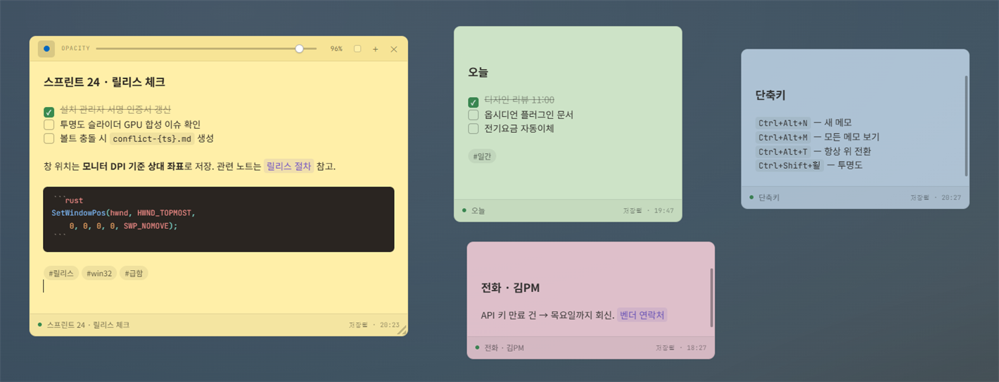
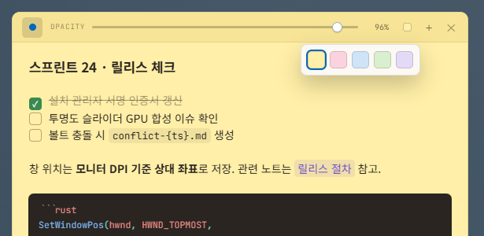
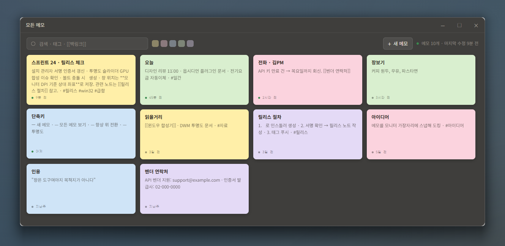
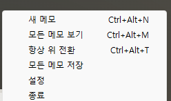
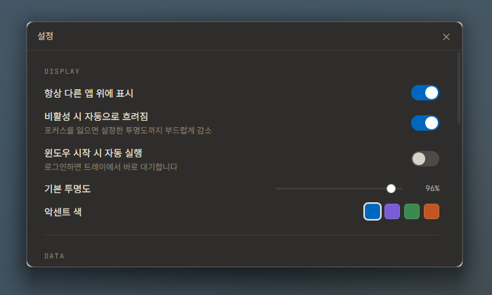
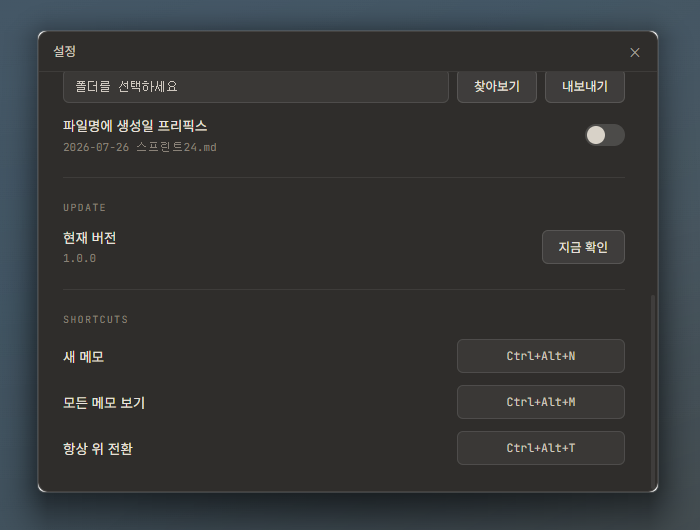

# 스티커 메모 (Sticky Notes for Windows)

**다른 앱 위에 떠 있는 메모지.** 브라우저나 코드 에디터를 클릭해도 사라지지 않고, 뒤 화면이 비칠 만큼 투명하게 흐려 둘 수 있고, 마크다운을 치면 **치는 즉시 렌더된 채로** 보인다.



Windows 11용 데스크톱 앱. 트레이에 상주하고, 설치본은 약 10MB다. 인터넷 없이 동작하며 메모는 전부 내 PC에만 저장된다.

| | |
|---|---|
| **항상 위** | 참고할 내용을 옆에 띄워 두면 창을 전환할 필요가 없다. 메모마다 켜고 끈다 |
| **투명도 35~100%** | 화면을 가리지 않으면서 내용은 읽히는 지점을 메모마다 따로 맞춘다. 위 스크린샷의 오른쪽 메모 3개가 76~92% |
| **마크다운 라이브 프리뷰** | 체크박스·코드블록·태그·위키링크가 편집 중에도 렌더된 모양이다. "편집 모드 / 보기 모드" 전환이 없다 |
| **원문 그대로 보관** | 저장되는 것은 마크다운 텍스트다. 언제든 `.md` 파일로 내보내 옵시디언 같은 앱에서 그대로 열 수 있다 |

---

## 설치

1. [Releases](https://github.com/pyjhoop/sticky-notes/releases)에서 최신 `.exe` 인스톨러를 받는다
2. 실행한다 — 현재 사용자로 설치되므로 관리자 권한이 필요 없다
3. **트레이(작업표시줄 오른쪽 아이콘 영역)에 아이콘이 생긴다.** 여기가 앱의 본거지다

새 버전이 나오면 앱이 스스로 알려 준다. 메모 창에 배너가 뜨고 `설치`를 누르면 저장한 뒤 알아서 업데이트하고 재시작한다. 설정 → `UPDATE` → `지금 확인`으로 직접 확인할 수도 있다.

---

## 사용법

### 새 메모 만들기

- 트레이 아이콘 우클릭 → `새 메모`
- 어디서든 **`Ctrl+Alt+N`**
- 메모의 컨트롤 바 `+`
- 보드 창의 `+ 새 메모`

저장 버튼은 없다. 타이핑을 멈추면 알아서 저장되고 아래 푸터에 `저장됨 · 20:23`이 뜬다.

### 컨트롤 바

메모 위에 마우스를 올리면 위쪽에 바가 나타난다.



| | |
|---|---|
| **●** 핀 | 이 메모를 다른 앱 위에 계속 띄운다. 켜져 있으면 점이 악센트 색 |
| **OPACITY** | 35~100% 슬라이더. 끌면 바로 반영된다 |
| **▪** 색상 | 5색 팔레트. 지금 색에는 악센트 색 테두리가 둘린다 |
| **+** | 새 메모 |
| **✕** | 이 메모 창을 닫는다 — **메모는 지워지지 않는다.** 보드에 남아 있고 다시 열 수 있다 |

**마우스를 메모 밖으로 빼면 바가 사라지고 종이만 남는다.** 글자가 밀리지 않고 바만 배경색에 녹아든다.

### 옮기기 · 크기 조절

컨트롤 바나 아래 푸터의 빈 곳을 끌면 창이 움직인다. 창 가장자리를 끌면 크기가 바뀌고, 우하단 삼각 그립도 쓸 수 있다. **종이 본문을 클릭하면 그 자리에 커서가 놓인다** — 본문은 드래그 손잡이가 아니다.

위치와 크기는 모니터별로 기억된다. 보조 모니터에 둔 메모는 다음 실행에도 같은 모니터 같은 자리에 뜨고, 그 모니터를 떼면 주 모니터 안쪽으로 끌어당겨 복원한다.

### 투명도

- 컨트롤 바 슬라이더
- 메모 위에서 **`Ctrl+Shift+마우스휠`** — 5%씩, 35~100 사이에서 멈춘다
- 설정에서 `비활성 시 자동으로 흐려짐`을 켜면, 메모를 클릭할 때 100%로 선명해지고 다른 앱으로 넘어가면 설정한 투명도까지 부드럽게 흐려진다

### 마크다운

치면 바로 그 모양이 된다. 커서를 그 위로 옮기면 `**`나 `[[ ]]` 같은 원래 기호가 드러나 고칠 수 있고, 커서가 빠져나가면 다시 숨는다.

| 이렇게 쓰면 | 이렇게 보인다 |
|---|---|
| `- [ ] 할 일` | 체크박스. **클릭하면 체크된다** (문서의 `[ ]`가 `[x]`로 바뀐다) |
| `- [x] 한 일` | 체크 + 취소선 + 흐린 글씨 |
| `# 제목` | 굵은 제목. 첫 제목이 메모 제목이 되고 보드 카드에도 쓰인다 |
| `**굵게**` `*기울임*` `~~취소~~` | 그대로 |
| `` `코드` `` | 회색 배경 인라인 코드 |
| ` ```rust ` … ` ``` ` | 다크 코드블록 + 언어별 색상. 언어 이름은 자유롭게 (`ts`, `rust`, `python`, `sql` …) |
| `[[다른 메모]]` | 보라색 알약. 보드에서 이 링크를 가리키는 메모를 역으로 찾을 수 있다 |
| `#태그` | 알약 칩. 보드에서 태그로 걸러 볼 수 있다 |
| `Tab` / `Shift+Tab` | 목록·코드블록 안에서 들여쓰기 / 내어쓰기 |

**이미지는 붙여넣기(`Ctrl+V`)로 넣는다.** 스크린샷을 찍어 그대로 붙이면 앱 폴더에 저장되고 본문에 인라인으로 나타난다. 이미지 우하단 손잡이를 끌면 크기가 바뀌고(문서에는 ``로 남는다 — 옵시디언과 같은 문법), 손잡이를 더블클릭하면 크기 지정이 사라진다.

### 보드 — 모든 메모 보기

트레이 아이콘을 **좌클릭**하거나 **`Ctrl+Alt+M`**.



닫아 둔 메모까지 전부 카드로 보인다. 카드를 클릭하면 그 메모 창이 열리고(이미 열려 있으면 앞으로 가져온다), **우클릭 → 삭제**로 지운다.

검색창은 입력한 모양에 따라 세 가지로 동작한다.

| 입력 | 찾는 것 |
|---|---|
| `회의` | 제목·본문에 그 글자가 들어간 메모. 한글도 부분 일치된다 — `프린트`로 `스프린트 24`가 찾아진다 |
| `#급함` | 그 태그가 붙은 메모 |
| `[[릴리스 절차]]` | 그 메모를 링크한 메모들 (백링크) |

옆의 5색 칩으로 색깔별 필터도 걸 수 있다.

### 트레이 메뉴



메모 창을 전부 닫아도 앱은 트레이에 남는다. 완전히 끝내려면 **`종료`**를 누른다.

### 단축키

| 키 | 동작 | 어디서 |
|---|---|---|
| `Ctrl+Alt+N` | 새 메모 | 어디서든 |
| `Ctrl+Alt+M` | 보드 열기/닫기 | 어디서든 |
| `Ctrl+Alt+T` | 지금 메모의 항상 위 토글 | 어디서든 |
| `Ctrl+Shift+휠` | 투명도 ±5% | 메모 위에서 |
| `Ctrl+V` | 이미지 붙여넣기 | 메모 안에서 |
| `Tab` / `Shift+Tab` | 들여쓰기 / 내어쓰기 | 메모 안에서 |

앞의 3개는 다른 앱과 겹칠 수 있다. **등록에 실패하면 앱이 알려 주고**, 설정 → `SHORTCUTS`에서 다른 키로 바꿀 수 있다.

---

## 설정

트레이 → `설정`.



- **항상 다른 앱 위에 표시** — 새로 만드는 메모의 기본값
- **비활성 시 자동으로 흐려짐** — 포커스를 잃으면 설정한 투명도까지 부드럽게 감소
- **윈도우 시작 시 자동 실행** — 로그인하면 트레이에서 바로 대기
- **기본 투명도**, **악센트 색** (파랑 · 보라 · 초록 · 주황)



- **DATA** — 데이터베이스 폴더 열기 / 백업 만들기 / **마크다운으로 내보내기** / 파일명에 생성일 프리픽스
- **UPDATE** — 현재 버전 · 지금 확인
- **SHORTCUTS** — 전역 단축키 3개 재바인딩

### 내보내기 · 백업

`마크다운으로 내보내기`에서 폴더를 고르면 메모마다 `.md` 파일을 쓴다. **옵시디언 볼트 폴더를 지정하면 바로 볼트에서 열린다.** 파일명 프리픽스를 켜면 `2026-07-26 스프린트24.md` 형태가 된다.

메모는 아래 한 폴더에 모여 있다. 이 폴더를 복사하면 그대로 옮겨진다.

```
%APPDATA%\com.sticky-notes.app\
├─ sticky-notes.db      메모 본문(마크다운 원문) · 태그 · 링크 · 창 위치 · 설정
└─ attachments\         붙여넣은 이미지
```

클라우드에 올리거나 외부로 보내는 동작은 없다 — 업데이트 확인 외에는 네트워크를 쓰지 않는다.

---

## 디자인

종이는 밝고, 관리 도구(보드·설정)는 어둡다. 메모는 화면 위의 물건처럼 보이고 도구는 화면 뒤로 물러난다.

메모 5색은 각각 **종이 / 크롬** 두 톤을 가진다. 크롬은 컨트롤 바 배경으로, 종이보다 한 단계 진한 같은 계열이다.

| | yellow | pink | blue | green | purple |
|---|---|---|---|---|---|
| 종이 | `#FFEFA8` | `#FBD3DE` | `#CFE4F7` | `#D9EFCF` | `#E4DAF6` |
| 크롬 | `#F7E496` | `#F3C4D2` | `#BED8F1` | `#CAE6BE` | `#D7C9F1` |

본문은 **Noto Sans KR** 14px/1.5, 코드와 라벨은 **JetBrains Mono**. 두 폰트 모두 앱에 포함되어 있어 오프라인에서도 같은 모양이다. 잉크 `#2a2521` · 완료된 할 일 `rgba(42,37,33,.45)` · 위키링크 `#6d4fc4` · 저장됨 `#3a8a4f`.

디자인 원본은 `design/Sticky Notes for Windows.dc.html`이고 [렌더된 화면](https://claude.ai/design/p/5a69a538-0b47-467b-90a1-3ee91ffde43f?file=Sticky+Notes+for+Windows.dc.html)에서 볼 수 있다. 색·치수·문구의 최종 근거다.

---

## 자주 겪는 것

**투명하게 했더니 글씨가 안 읽힌다** — 35%는 상당히 투명하다. 뒤 배경이 복잡하면 60~75%가 실용적이다. `비활성 시 자동으로 흐려짐`을 켜면 읽을 때는 항상 100%가 되므로 평소 값을 더 낮춰도 된다.

**`Ctrl+Alt+N`이 안 먹는다** — 다른 앱이 먼저 잡고 있다. 설정 → `SHORTCUTS`에서 바꾼다.

**메모를 실수로 닫았다** — `✕`는 삭제가 아니다. 보드(`Ctrl+Alt+M`)에서 카드를 클릭하면 다시 열린다. 정말 지우려면 보드에서 우클릭 → 삭제.

**메모가 안 보인다** — 다른 모니터나 화면 밖일 수 있다. 보드에서 카드를 클릭하면 화면 안으로 끌어당겨 다시 띄운다.

**앱을 껐는데 트레이에 남아 있다** — 그게 정상이다. 메모 창을 다 닫아도 트레이에서 대기한다. 완전 종료는 트레이 → `종료`.

---

## 소스로 빌드하기

```bash
npm install
npm run tauri dev       # 개발 실행
npm run tauri build     # NSIS 인스톨러 생성
```

필요한 것: Node 24+, Rust + Visual Studio Build Tools(MSVC), WebView2(Windows 11 기본 포함). SQLite는 번들되어 별도 설치가 없다.

**기술 스택** — Tauri v2(Rust) · React 19 + TypeScript + Vite · CodeMirror 6 · SQLite(rusqlite). 메모 8개를 띄운 상태에서 200~300MB 정도를 쓴다.

프로젝트 문서는 `plan.md`(설계)와 `process.md`(진행)에 있다.

---

## 아직 없는 것

**옵시디언 양방향 동기화.** 지금 연결 고리는 단방향인 "마크다운으로 내보내기" 하나다. 본문을 처음부터 마크다운 원문으로 저장하는 이유가 이 다리를 나중에 넓히기 위한 것이다.
